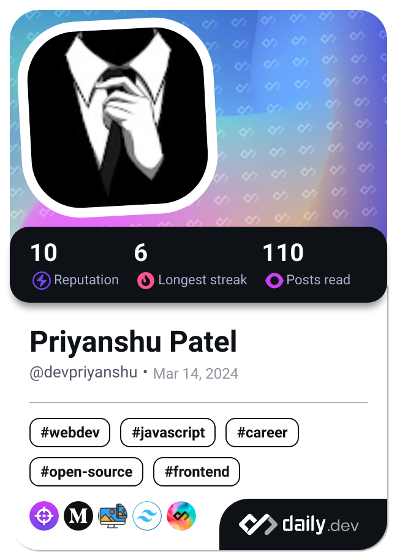

<h2>Hi there 🙏🏻, I'm Priyanshu! A passionate Full-Stack(MERN) developer from India. 
  </h2>
<p align="center">
  
</p>

<h3>

<p><em>@2020#Full Stack MERN Developer  🤝🏻DCT Academy🤝🏻.
</em></p>
 </h3> 

<h3> 🤝🏻 Connect with Me </h3>

<p align="center">
<a href=""></a>
<a href="https://github.com/sammy-cool"></a>
<a href="mailto:priyanshu.alt191@gmail.com"></a>
</p>

**Languages and Tools:**  

<code></code>
<code></code>
<code></code>    
<code></code>
<code></code>
<code></code>
<code></code>
<code></code>
<code></code>

<h4>
👇 Hit in your console or terminal to connect with me.
</h4>
```bash
   npx priyanshu
```

###  A little more about me...  

```javascript
const priyanshu = {
    pronouns: "He",
    code: ["Javascript",],
    technologies: {
        frontEnd: {
            js: ["Javascript", "React", "react-redux"],
            css: ["materialize", "bootstrap"]
        },
        backEnd: {
            js: ["node", "express"],
        },
        databases: ["mongo", "NoSql"],
    },
    currentProject: "...",
    funFact: "The more you Practise(coding), the more you learn because this is the endless journey"
};
```
😊<p align="left"> <em><b>I love connecting with different people</b> so if you want to say <b>hi, I'll be happy to meet you more!</b> </em> </p> <p align="center"> <a href="https://app.daily.dev/devpriyanshu"></a> </p> 😊


---
